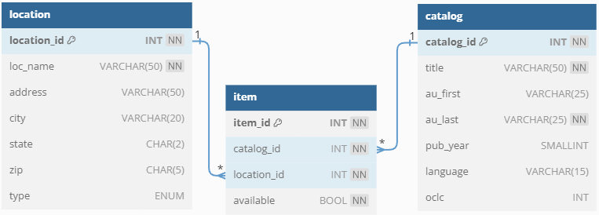

# Essex Country Special Collections Record Share Database
This MySQL database is a proof of concept for the sharing of records between a small
consortium of 2 libraries, 1 museum and 1 archive. The example data is fictional and refers to
locations mentioned in H.P. Lovecraft’s Cthulhu mythos, along with actual historic books that are
referenced within his oeuvre. This database allows for the 4 locations in the Essex County
consortium to share their records. Stakeholders can know where an item of interest currently
resides, how many copies are held throughout the systems, all of the held works by a particular
author, as well as which items are available to view and/or reserve. The field lengths are
designated with both efficiency and scaling in mind

## Entity Relationship Diagram

## Data Dictionary
|Table|Name|Data Type|Constraint|Description|Sample|
|:----|:----|:----|:----|:----|:----|
|item| | | | | |
| |item_id|INT|Primary Key|Auto Incremented ID for items|105|
| |catalog_id|INT|Not Null|Foreign Key references catalog_id of catalog table|35|
| |location_id|SMALLINT|Not Null|Foreign Key references location_id of location table|3|
| |available|BOOL|Not Null|Whether the item is available or not|TRUE or FALSE or 1 (for true) or 0 (for false)|
|catalog| | | | | |
| |catalog_id|INT|Primary Key|Auto Incremented ID for catalog|35|
| |title|VARCHAR(50)|Not Null|Title of the work|'The Shadow Over Innsmouth'|
| |au_first|VARCHAR(25)| |First and middle name, if applicable|'Howard Phillips'|
| |au_last|VARCHAR(25)|Not Null|Last name or only name, if applicable|'Lovecraft'|
| |pub_year|SMALLINT| |4 digit year or less, BCE as negative|1536|
| |lang|CHAR(3)| |3 digit ISO 639-1 codes|'ENG'|
| |oclc|INT| |OCLC number for cross referencing Worldcat.org|3920225|
|location| | | | | |
| |location_id|SMALLINT|Primary Key|Auto Incremented ID for location|3|
| |loc_name|VARCHAR(50)|Not Null|Full name of the location|'Dunwich Public Library'|
| |address|VARCHAR(50)| |Street number and street name|'1234 Fake St'|
| |city|VARCHAR(20)| |City name|'Innsmouth'|
| |state|CHAR(2)| |two-character state code|'MA'|
| |zip|CHAR(5)| |5 digit zip/postal code|'01984'|
| |type|ENUM| |Type of location|library', 'museum', or 'archive'|
